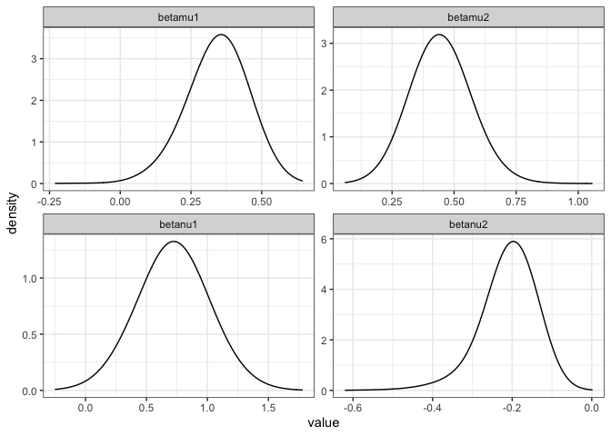
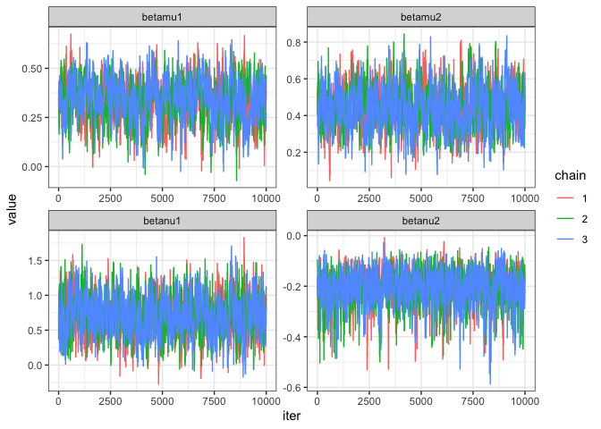

<!-- README.md is generated from README.Rmd. Please edit that file -->

# cpbayes

Fast rejection sampling and Bayesian inference for COM-Poisson
regression models [Benson and Friel
(2021)](https://projecteuclid.org/journals/bayesian-analysis/volume-16/issue-3/Bayesian-Inference-Model-Selection-and-Likelihood-Estimation-using-Fast-Rejection/10.1214/20-BA1230.full).
Regression structure on the location and dispersion parameters is
supported and MCMC sampling relies on the exchange algorithm.

Please ensure proper setup of a C++ compiler as our package links to
Rcpp and RcppArmadillo (you might test this by installing these two
first). Uncomment the following command line to install `cpbayes` from
this GitHub repository.

``` r
#devtools::install_github("luizapiancastelli/cpbayes")
library(cpbayes)

ls("package:cpbayes") #List of currently exported functions
#> [1] "dcompois"     "fitcpbayes"   "inventory"    "pcompois"     "qcompois"    
#> [6] "rcompois"     "takeoverbids" "Zhat"
```

Usage of `rcompois` for set parameter values (the fast-rejection
sampler):

``` r
Y = rcompois(n =100, mu =1, nu = 0.5)
```

### COM-Poisson regression

Function `fitcpbayes` fits a COM-Poisson GLM and a quick check of its
arguments is rendered by `help("fitcpbayes")` (documentation under
development!). The code below provides and example of its usage with the
`takeoverbids` data set (model 4 in (Benson and Friel (2021)) ) and some
methods currently available.

``` r
#help("fitcpbayes")
data("takeoverbids")

mcmc = fitcpbayes(numbids ~ whtknght, numbids ~ size, takeoverbids, 10000, 10000, nchains =3)

summary(mcmc) #Gives the number of efficient draws neff and scale reduction factors Rhat
#> # A tibble: 4 × 8
#>   param     mean     sd     Q5    Q50    Q95  rhat  neff
#>   <chr>    <dbl>  <dbl>  <dbl>  <dbl>  <dbl> <dbl> <dbl>
#> 1 betamu1  0.339 0.101   0.159  0.343  0.496  1.01  461.
#> 2 betamu2  0.448 0.110   0.271  0.448  0.631  1.00  589.
#> 3 betanu1  0.705 0.270   0.264  0.699  1.16   1.00  731.
#> 4 betanu2 -0.204 0.0640 -0.321 -0.197 -0.116  1.01 1069.
```

``` r
plot(mcmc)
```



``` r
plot(mcmc, type = 'trace')
```



``` r
BIC(mcmc)
#> [1] 374.019
```
