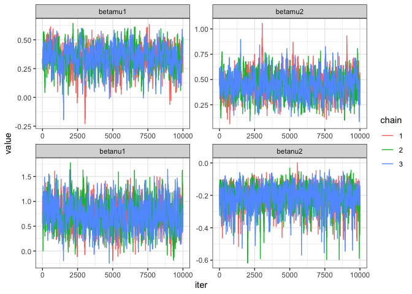

<!-- README.md is generated from README.Rmd. Please edit that file -->

# cpbayes

Fast rejection sampling and Bayesian inference for COM-Poisson
regression models [Benson and Friel
(2021)](https://projecteuclid.org/journals/bayesian-analysis/volume-16/issue-3/Bayesian-Inference-Model-Selection-and-Likelihood-Estimation-using-Fast-Rejection/10.1214/20-BA1230.full).
Regression structure on the location and dispersion parameters is
supported and MCMC sampling relies on the exchange algorithm.

Please ensure proper setup of a C++ compiler as our package links to
Rcpp and RcppArmadillo (you might test this by installing these two
first). Uncomment the following command line to install `cpbayes` from
this GitHub repository.

``` r
#devtools::install_github("luizapiancastelli/cpbayes")
library(cpbayes)
#> 
#> Attaching package: 'cpbayes'
#> The following object is masked from 'package:stats':
#> 
#>     BIC
ls("package:cpbayes") #List of currently exported functions
#> [1] "BIC"          "dcompois"     "fitcpbayes"   "inventory"    "pcompois"    
#> [6] "qcompois"     "rcompois"     "takeoverbids" "Zhat"
```

### COM-Poisson distribution

`cpbayes` provides a family of functions designed to work with the
COM-Poisson distribution, namely `rcompois`, `dcompois`, `pcompois` and
`qcompois`. A call to `help` renders documentation where further details
on their implementation can be found.

`rcompois` is the key component among these, an implementation of the
fast-rejection sampler of Benson and Friel (2021) that gives from a
COM-Poisson with location

and dispersion parameter
.
Currently `dcompois`, `pcompois` and `qcompois` involve approximation of
the normalisation constant via truncation, included so that `cpbayes`
gives a complete framework to work with the COM-Poisson.

The next code chunk exemplifies simulating over and underdispersed
counts with `rcompois` and computation of some COM-Poisson
probabilities.

``` r
Y1 = rcompois(n =200, mu =1, nu = 0.2) #nu < 1 renders overdispersed count data
Y2 = rcompois(n =200, mu =1, nu = 1.5) #nu > 1 underdispersion
c(mean(Y1), var(Y1))
#> [1] 2.805000 6.127613
c(mean(Y2), var(Y2))
#> [1] 0.7450000 0.5929397
#approximate mean and variance are E(Y) ~ mu + 1/2nu -1/2 and Var(Y) ~ mu/nu

#P(Y = 0)
dcompois(0, mu =1, nu = 0.2)
#> [1] 0.1903481
dcompois(0, mu =1, nu = 1.5)
#> [1] 0.4113677

#P(Y <= 1) for Y1, Y2
pcompois(1, mu = 1, nu= 0.2)
#> [1] 0.3806962
pcompois(1, mu = 1, nu=1.5)
#> [1] 0.8227354

#Median of distribution 
qcompois(0.5, 1, 0.2)
#> [1] 2
qcompois(0.5, 1, 1.5)
#> [1] 1
```

### COM-Poisson regression

In addition to the COM-Poisson distribution functions, `cpbayes` fits
generalised linear models to COM-Poisson distributed counts in the
Bayesian framework. Regression structure via the logarithm link is
supported in the location and dispersion parameters. This model assumes
counts

to be COM-Poisson distributed with likelihood

 =  \left( \dfrac{\mu_i^{y_i}}{y_i!} \right)^{\nu_i} \frac{1}{Z(\mu_i, \nu_i)}")

where
 = \sum_{y=0}^\infty q(y_i|\mu_i, \nu_i)"),
 = \left( \frac{\mu_i^{y_i}}{y_i!} \right)^{\nu_i}")
and the regression
")
and
").

and

are observed covariates accounted in

and

for explaining
.

The function `fitcpbayes` runs Markov Chain Monte Carlo for

Bayesian inference using the exchange algorithm (Murray (2006)). Further
details on the exchange framework for intractable likelihoods and
arguments to `fitcpbayes` are rendered by `help("fitcpbayes")`.

Code below provides and example of its usage with the `takeoverbids`
data, a data set on the number of bids `numbids` received by U.S. firms
in the period 1978-1985 that were taken over within 1 year of the
initial offer. This is modeled alongside the potential covariates
`whtknght` and `size` described in `help(takeoverbids)`.

`fitcpbayes`’s basic arguments include `R` formulas for

and
,
the data set (a `data.frame`), number of iterations to discard as
`burnin` and to store (`niter`). `nchains` specifies how many MCMC
chains to run and parallel computation can be enabled by setting
`ncores`. `fitcpbayes` outputs an object of class `cpbayes` for which
generic `summary` and `plot` methods are available.

``` r
data("takeoverbids")
mcmc = fitcpbayes(numbids ~ whtknght, numbids ~ size, takeoverbids, 10000, 10000, nchains =3)

summary(mcmc) #neff is the number of efficient draws, and Rhat the potential scale reduction factor, estimated if nchains>1
#> # A tibble: 4 × 8
#>   param     mean     sd     Q5    Q50    Q95  rhat  neff
#>   <chr>    <dbl>  <dbl>  <dbl>  <dbl>  <dbl> <dbl> <dbl>
#> 1 betamu1  0.336 0.0990  0.169  0.341  0.489  1.00  520.
#> 2 betamu2  0.450 0.108   0.275  0.448  0.628  1.00  597.
#> 3 betanu1  0.699 0.263   0.266  0.699  1.13   1.00  897.
#> 4 betanu2 -0.208 0.0654 -0.330 -0.200 -0.118  1.00 1084.
```

``` r
plot(mcmc) #density plots using combined posterior draws
```


``` r
plot(mcmc, type = 'trace') #trace plots colored by chain run
```



`cpbayes` also provides BIC estimation for comparing between models
fits. This is automatic from a `cpbayes` object, where likelihood
estimation occurs is linked to the acceptance rate of COM-Poisson
rejection sampling. For more details, please see the indicated reference
or `help("BIC")`. Let’s consider another regression structure for the
`takeoverbids` problem and use this tool for model selection.

``` r
mcmc2 = fitcpbayes(numbids ~ whtknght + bidprem, numbids ~ size, takeoverbids, 10000, 10000, nchains =3)

BIC(mcmc)
#> [1] 374.1528
BIC(mcmc2)
#> [1] 380.2662
```

It looks like the data further supports `numbids ~ whtknght`

regression in comparison to `numbids ~ whtknght + bidprem`.

#### No regression

A special case of `fitcpbayes` is implemented for when we are interested
in Bayesian inference for the

parameters with no regression structure. As an example, let’s revisit
`Y2` and see how the model fit supports the true values used to generate
the data, these were
.

``` r
y2 = data.frame('y' = Y2)
mcmc3 = fitcpbayes(y ~ 1, y ~ 1, y2, 10000, 10000, nchains =1)

summary(mcmc3)
#> # A tibble: 2 × 7
#>   param  mean    sd    Q5   Q50   Q95  neff
#>   <chr> <dbl> <dbl> <dbl> <dbl> <dbl> <dbl>
#> 1 mu    0.859 0.117 0.649 0.869  1.03  138.
#> 2 nu    1.32  0.280 0.881 1.30   1.80  185.
```

Looks like the true values have high posterior probability as expected!
